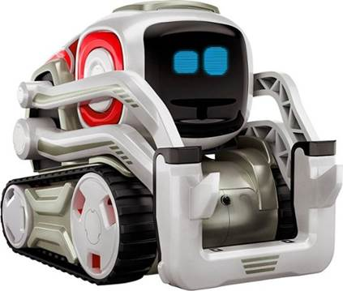
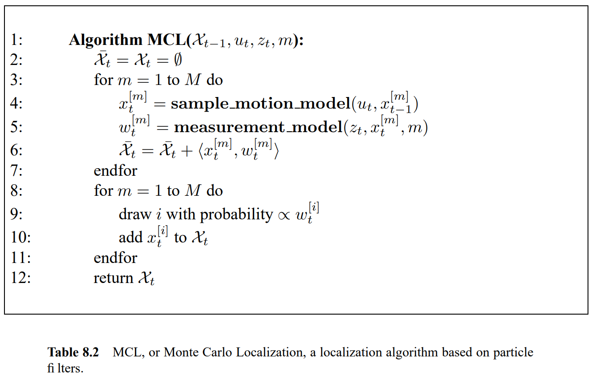
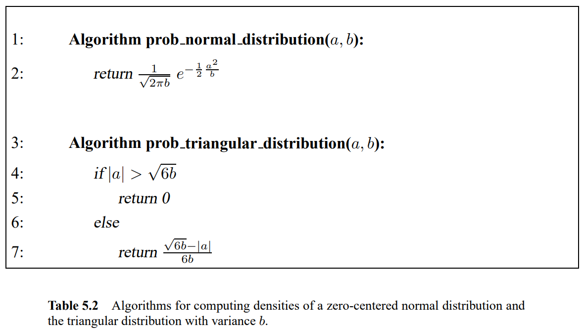
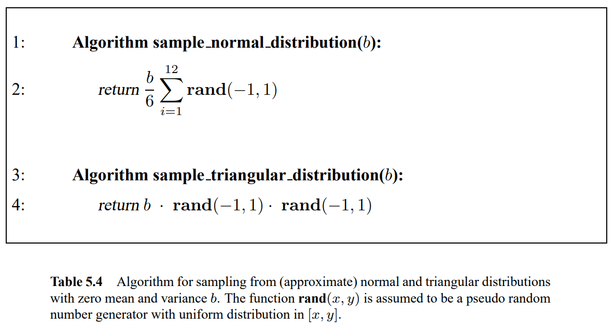
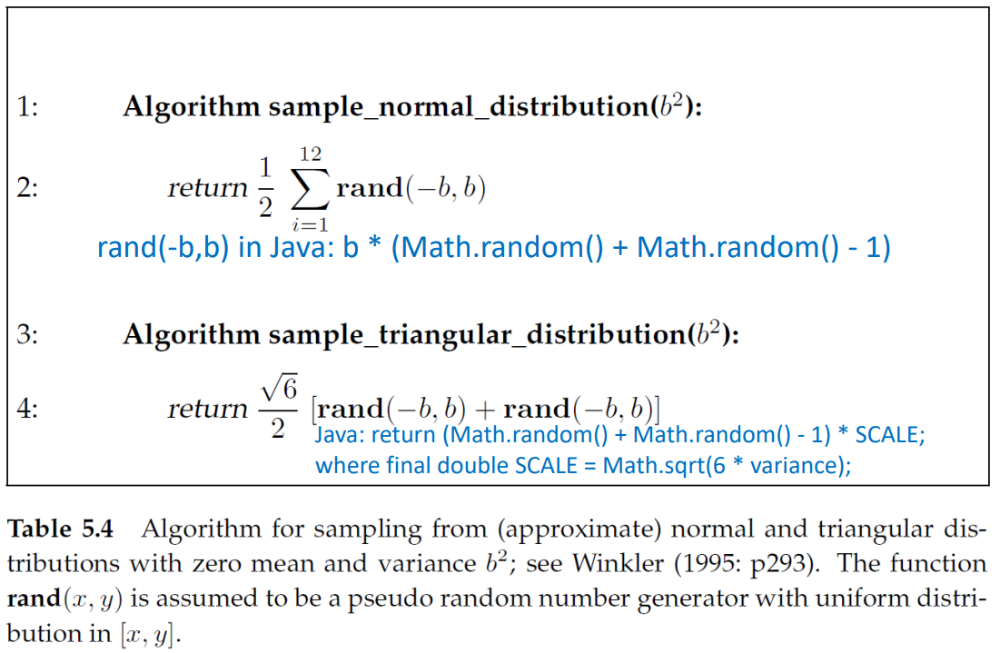
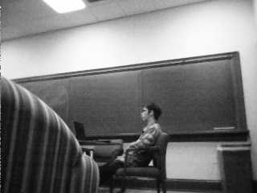

<h1 align="center" id="top-page">Anki Cozmo Kidnapping using Monte Carlo Localization</h1>

<p align="center">
Nicholas Stach, Quan Nguyen, Brayton Alkinburgh, Douglas Harsha
<br>
<i>Spring 2023</i>
<br>
Src code ( <a href="https://github.com/QuanHNguyen232/MonteCosmoLocalization" target="_self">github</a>, <a href="https://www.youtube.com/watch?v=xvFZjo5PgG0" target="_self">zip</a><sup><a id="footnote-zipfile-ref" href="#footnote-zipfile">[1]</a></sup>)
<br>
<p align="center"></p>
</p>

Goal:
* Implement MCL with Anki Cozmo
* Create Panorama of collected images from which the Cozmo bot can use to find its position and relocate itself.
* Create means of displaying belief probabilities.
* Docs: [Cozmo API](https://data.bit-bots.de/cozmo_sdk_doc/cozmosdk.anki.com/docs/api.html)
* Helpful [link](https://github.com/nheidloff/visual-recognition-for-cozmo-with-tensorflow/blob/master/1-take-pictures/take-pictures.py) for taking pictures with cozmo and saving them.


---
## Table of Contents
1. [Setup](#setup)
1. [Understanding algorithm](#understanding-algorithm)
1. [Tasks](#tasks)
1. [Files and Dirs](#files-and-dirs)
1. [Approaches](#approaches)
1. [Running](#running)
1. [Working log](#working-log)

---

## Setup

Following the [installation guide from Cozmo](http://cozmosdk.anki.com/docs/initial.html)

* Setup on computer + phone:
   * <details><summary>Computer Setup</summary>

      1. Follow the [Initial setup](http://cozmosdk.anki.com/docs/initial.html):
         * Install Anki Cozmo SDK
         * SDK Example Programs: download and extract to any directory
      1. Install [Android Debug Bridge](http://cozmosdk.anki.com/docs/adb.html#adb), follow that to [Final installation](http://cozmosdk.anki.com/docs/adb.html#final-install).
      1. Setup environment (recommend using Anaconda): Python 3.8 + required packages in requirements.txt:
         * Create environment:
            ```bash
            conda create -n envname python=3.8
            ```
         * Activate environment:
            ```bash
            conda activate envname
            ```
         * Install all required packages:
            ```bash
            pip install -r requirements.txt
            ```
      </details>
      
   * <details><summary>Mobile Phone (Android) Setup</summary>
   
      1.	Install official Cozmo app on phone ([Android](https://play.google.com/store/apps/details?id=com.digitaldreamlabs.cozmo2&hl=en_US&gl=US)/[iOS](https://apps.apple.com/us/app/cozmo/id1154282030))
      1.	Enable USB debugging on your device. This step may vary based on your phone, so check the [android instruction](https://developer.android.com/studio/debug/dev-options) if needed.
      1. Those steps are required everytime working on project:
         i.	Connect USB cable from phone to computer
         1. Run `adb devices` on CommandPrompt on computer to check and authorize your phone. (unil it appears "device" instead of "unauthorized")
         1.	Open Cozmo app and turn Cozmo bot on 
         1.	Connect to Cozmo bot’s wifi network.
         1.	Enable SDK on Cozmo app
   </details>

   * After setting up on both machines, download the SDK Examples, open Cozmo app, connect with cozmo bot (ensure the robot does not fall off the desk) -> setting -> enable SDK. Then try running the examples.

* <details><summary>Website Publishing</summary>

   1. Generate html file:
      * Find your Chrome's download folder in your local machine. It will be asked in your terminal.
      * Run the generator:
         ```bash
         python html-generator.py
         ```

   1. Upload html file and assets (if any) to `/public_html/` folder on lab machine at Gettysburg College.
      ```bash
      chmod -R 755 ~/public_html/folder_to_publish
      chmod -R 755 .
      ```
   </details>

<p align="right"><a href="#top-page">[Back to top]</a></p>

---

## Understanding algorithm

In our code, there are comments that refer to table, etc. Those refer to the algorithms from the "[Probabilistic Robotics](http://robots.stanford.edu/probabilistic-robotics/)" by Sebastian Thrun, Wolfram Burgard and Dieter Fox.

* <details><summary>Pseudo code for MCL</summary>
   <p align="center"></p>
</details>

* <details><summary>Table 5.2</summary>
   <p align="center"></p>
</details>

* <details><summary>Table 5.4</summary>
   <p align="center"></p>

   The formula above, however, is a bit different from the one from Prof. Neller's lecture:

   <p align="center"></p>
</details>


<p align="right"><a href="#top-page">[Back to top]</a></p>

---

## Tasks
* [ ] Future:
   * How to improve accuracy
   * How to make it works in dark environment (may use edge detection??)
   * How to localize with just 4 images (0, 90, 180, 270 degrees) (divide imgs into $n$ cols then compare w/ $n$ cols of each img for all $m$ ims?)
* [X] Get robot to turn to location it has highest belief prob after MCL done
* [X] Polish borrowed code: make more succint, use methods we have already coded.  
* [X] Read MCL slides + Java demo code (convert to python) (Bray & Doug)
* [X] Try running MCL w/ pano
* [X] How to rotate robot
* [X] How to get image from cozmo’s camera (file `picture-collection.py`)
* [X] Fix MCL code for images (check [Youtube](https://www.youtube.com/watch?v=JhkxtSn9eo8) and github) (file `my-MCL.py`)
* [X] Create a panorama (optional)
   * Check openCV Stitching (e.g from prev group: [L.Attai,R.Fuller,C.Rhodes](http://cs.gettysburg.edu/~tneller/archive/cs371/cozmo/22sp/fuller/Stitching.py))
* [X] Crop pano img + sensor img in MCL algo (Nick)
* [X] Recreate MCL as per supplied examples (based on [L.Attai,R.Fuller,C.Rhodes](http://cs.gettysburg.edu/~tneller/archive/cs371/cozmo/22sp/fuller/MCLocalize.py)))

<p align="right"><a href="#top-page">[Back to top]</a></p>

---
## Files and Dirs
* `/cozmo-images-kidnap/`: images for kidnap problem (collected data that is updated for each run)
   * `x.jpg`: images captured when running `kidnap.py` for localization.
   * `data.csv`: result of localization, used to generate histogram.
   * `hist.png`: histogram of collected belief probablities after MCL is run
* `/model/`: directory for training/inference neural network model.
* `cozmo_MCL.py`: MCL implementation, based on previous group's work (stitching method).
* `kidnap.py`: main file to run localization (stitching method).
* `cozmo_MCL_nn.py`: MCL ver. for neural-net w/ much cleaner code.
* `kidnap_nn.py`: main file to run localization (neural-net).
* `MCL_simple.py`: simple version of MCL (not the MCL described in Prof. Neller's lecture -> not accurate)
* `requirements.txt`: has all required installs for use with our code and Cozmo
* `html-generator.py`: convert `md` to `html` file using [codebeautify.org](https://codebeautify.org/markdown-to-html). This yields much better html than python library like [python-markdown](https://python-markdown.github.io/)
* `index.html`: result of `html-generator.py`.

<p align="right"><a href="#top-page">[Back to top]</a></p>

---

## Approaches

* Stitching method:
   * <details><summary>Functionality</summary>

      Our Cozmo MCL was able to localize with reasonable accuracy in some environments (in cases where the Stitching works well). Locations with repetative patterns or extreme amounts of light greatly reduced accuracy of the localization. 

      Our group was able to improve upon a past group's MCL and make it give Cozmo a command to turn to home accordingly toward from its most believed location. Our group also created a histogram with clustered probablities and implemented the highest belief into the MCL to serve as the location to turn to.

      </details>

   * <details><summary>Results</summary>

      Building off of the work of Leah Attai, Casey Rhodes, and Rachel Fuller, as well as examples provided by Mohammad Altaleb, we were able to construct a Monte Carlo Localization System that successfully localized the Anki Cozmo robot in some environments. Our system centered around a set of 30 photos taken 12 degrees apart to form a panorama. The panorama mapped the 360 degree area around the robot prior to its "kidnapping." By rotating the robot an arbitrary number of degrees, we then "kidnapped" the robot. The robot would then take a single picture, and we performed a set of pixel-matching operations to determine which section of the panorama most likely corresponded with the robot's kidnapped heading. We would repeat this process ten times, rotating the robot slighty each time to collect varied data and increase the accuracy of our final identification. Thus having localized, we turned the robot to turn towards its initial "home" position, represented as the starting point of the panorama, reversing the kidnapping.

      Our system's performance was generally dependent upon the success of two functions. Firstly, in order to create the panorama it was necessary to stitch together the 30 initial photos. Our stitching function, based on an example from OpenCV, struggled in certain environments that reduced the distinctions between certain photos. Too much or too little light, or a lack of identifiable landmarks would stymie the algorithm, and thus produce a low-confidence panorama that induced difficulties in our localization attempts. Secondly, out pixel-matching comparison algorithm would struggle from much the same issues, running into situations were a large area of the panorama (such as a white wall) appeared as candidates for localizations. This issue was likely the cause of several failed tests where the Cozmo robot localized close but not exactly to its home position, within 20 degrees or so.

      The following table shows examples of test images taken in sequence that were and were not conducive to panorama-based localization. The top two, taken in the CS Lounge, are visually distinct with enough "landmarks" such as the striped couch, trash can, person, and chair to allow our algorithm to successfully localize. The bottom two, taken next to the CS Lounge printer, are too similar for the algorithm to extract any meaningful data -- localizations in this area appeared to be little more than guesses.

      <table align="center"> 
            <tr>
            <td></td>
            <td></td>
            </tr>
            <tr>
            <td></td>
            <td></td>
            </tr>
         </table>

      This Histogram shows the results of one test of our localization system. The X-Axis is the width of the panorama corresponding to the 360 degree area in pixels, the Y-Axis the total probabilistic likelihood that the Cozmo is facing that area of the panorama. Blue lines represent the Cozmo's confidence in its location before localization, orange represents its confidence after localization. The point with the highest probability, here just after pixel 1400, was selected as the kidnapped location.

      <p align="center">
      
      </p>

   </details>

* NeuralNet method:
   * <details><summary>Functionality</summary>

      Theoretically, this approach works well when we tested on Google Colab. The advantage of this method is that it compares the images based on the similarity, which should be more accurate than compare pixel-by-pixel like in stitching method.

      In MCL function for this approach, the return degree for Cozmo bot after determining current position is not yet verified.

   </details>

   * <details><summary>Result</summary>
      N/A
   </details>

<p align="right"><a href="#top-page">[Back to top]</a></p>

---

## Running
* Stitching method: After code cleaning, errors were found and the it got worse while trying to fix them. Running the program (cleaned ver.):
   ```bash
   python kidnap.py
   ```
   If it does not work well, try the one under `/working_ver/`, which is believed to contain the working code. Remember to ensure that the file paths work.
* NeuralNet method:
   * Install extra packages. Note that this installs PyTorch, so make sure GPU is enabled:
      ```bash
      pip install -r ./model/requirements.txt
      ```
   * Run kidnapping problem:
      ```bash
      python kidnap_nn.py
      ```
<p align="right"><a href="#top-page">[Back to top]</a></p>

---

## Future Goals

<details><summary>Stitching method</summary>

   The stitching algorithm used in this project would sometimes struggle with environments with few landmarks or excess/lack of light, thus not stitching all images together (issue from OpenCV). This would create a panorama that was not a true 360 degree view. Future groups could attempt a different stitching algorithm or attempt to build a world map in a different way. Our group recommendation is to avoid the use of a panorama (stitched from images) all together, as it proved too brittle for varied environments and was never as accurate as we had wanted. Other groups in this semester reported similar negative findings on the use of a panorama as well.

   Future groups could also rework our MCL to where Cozmo does not stop localizing until a certain belief probability/number of predictions for a location is reached. Our current implementation only rotates 10 times to localize before committing to the final belief probabilities.

   Our group's localization also relied on a program to randomly determine a kidnap location and then would automatically run MCL to localize. Future groups could have Cozmo map it's environment, then be in a state where it tries localize if it believes it is not at "home."

   </details>

<details><summary>NeuralNet method</summary>

   We would love to hear results from those groups that want to continue our work. Here are some suggestions to try:
   * Try from the most basic step: take 72 images (rotate 5 degrees/each image) and run the algorithm to check the accuracy (check both *estimated position* and *angle to rotate*).
   * Try with less images, can be 30, 20, 8 images. The less number of images, the more you have to do to justify to rotate robot back to the original position. I suggest smaller steps:
      1. Use our model to determine the closest image to the original position
      1. Use sliding window on that image (and adjacent left, right images) to determine the exact position (like [Ben Durham's](http://cs.gettysburg.edu/~durhbe01/cozmo/)).
   * Try with different light levels.
   * Keep fine-tuned model to achieve better representative vector.
   </details>

<p align="right"><a href="#top-page">[Back to top]</a></p>

---

## Working log
<details>
<summary>Click to expand</summary>

| Data/Time | Activity | Member |
| :--- | :--- | ---: |
| 3/17: 1:00-2:00pm | Setup Project | Brayton & Nick |
| 3/23: 4:15-5:15pm | Setup Project & Doc of steps | Doug & Nick |
| 3/24: 1:00-5:00pm | Connect to Cozmo, implement basic MCL & pic collection | Doug, Quan & Nick |
| 3/29: 2:00-5:00pm | MCL, refine code for pic collection | Doug, Quan & Nick |
| 3/31: 2:00-4:45pm | Done take1Pic, kidnap | Doug, Quan & Nick |
| 3/31: 5:15-6:30pm | Modify and fix bug in MCL | Quan |
| 4/1: 1:00-1:50am | Add MSE+Cos_Similar, try MCL, bad result --> suggest creating pano | Quan |
| 4/5: 3:30-5:30pm | Image stiching for creation of pano | Quan & Nick |
| 4/7: 1:20-3:30pm | Image cropping, MCL redo | Nick, Quan, Brayton |
| 4/7: 3:30-4:30 pm | MCL redo | Nick, Quan |
| 4/12: 2:20-4:50pm | Working on new MCL based on previous group efforts | Nick |
| 4/12: 7:00-7:50pm | MCL debugging | Nick |
| 4/14: 1:00-2:30pm | MCL testing/debugging | Brayton |
| 4/14: 1:00-5:20pm | MCL testing/debugging | Nick |
| 4/16: 9:20-10:00pm | Make Cozmo relocalize after MCL | Nick |
| 4/16: 2:00-4:30pm | Make Cozmo relocalize after MCL | Nick | 
| 4/21: 1:00-2:30pm | Cozmo localization tuning, website with documentation | Nick, Doug, Brayton |
| 4/21: 2:30-5:40pm | Cozmo localization tuning, bins for histogram | Nick |
| 4/21: 5:00-7:00pm | Modifying pic collection | Brayton |
| 4/22: 8:00-9:00pm | Modified kidnap | Brayton |
| 4/23: 7:00-10:00pm | Modified MCL to use new map system | Brayton |
| 4/24: 9:30-10:30am | Changing MCL and supplementary files | Brayton |
| 4/24: 1:00-2:00pm | Documentation and archiving of work | Nick, Quan, Brayton |
| 4/24: 10:00-12:00pm | Write website framework, outline, review final code | Doug |
| 4/25: 5:15-8:30pm | Clean code, add html-generator, create dataset (1440 imgs) | Quan |
| 4/25: 7:00-12:00am | Implement sentence_transformers, found unuseful with pretrained (clip-ViT-B-32) | Brayton |
| 4/26: 10:00-3:00am | Populate website, write copy, finalize website objects and sections | Doug |
| 4/26: 11:00-12:15pm | Add baseline to train siamese network | Quan |
| 4/26: 1:30-3:30pm | Add training loop | Quan |
| 4/27: 4:30-6:30am | Fine-tuned model on our dataset (success) | Quan |
| 4/28: 7:30-8:30pm | Write doc + clean code + publish website | Quan, Nick |
| 5/3: 1:30-5:30pm | Clean + factorize code --> found errors, integrate NN model into MCL | Quan |
| 5/4: 2:30-6:00pm | Debugging, creating separate branch for finished work in Github | Nick |
| 5/4: 1:00-7:45pm | Continue work on 5/3 | Quan |
| 5/5: 1:00-2:00pm | Finalize NeuralNet approach. Ran test on GG-Colab; did not have chance to test w/ robot | Quan |
| 5/5: 2:00-3:00pm | Cont. cleaning code -> give up since the `cozm_MCL.py` and `kidnap.py` are such a huge mess & finalize README | Quan |

</details>
<p align="right"><a href="#top-page">[Back to top]</a></p>

---


<footer>
  <p id="footnote-zipfile"><a href="#footnote-zipfile-ref">[1]</a> Src code (zip) is only available on Gettysburg College server (<a href="http://cs.gettysburg.edu/~nguyqu03/cs371/MonteCosmoLocalization.zip">download</a>) (last update: 5/6/2023).</p>
</footer>
